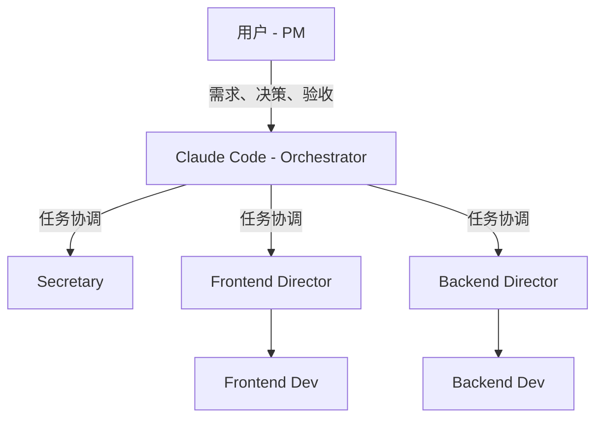

# CLAUDE.md

This file provides guidance to Claude Code (claude.ai/code) when working with code in this repository.

## Project Overview

AgentMesh 是一个多 Code Agent 编排框架，用于协调多个异构 agent（Codex、Claude Code、gemini-cli 等）完成复杂开发任务。当前状态：WIP，以设计与产物落地为主。

核心目标：把"一个 agent 扛全栈"升级为"多 agent 专业化分工 + 有序协作"。

## Development Commands

```bash
# 安装依赖
uv sync                           # 后端 Python 依赖
cd apps/gui && npm install        # 前端依赖

# 运行开发服务器
just backend dev                  # 后端 orchestrator
just frontend dev                 # 前端 GUI (apps/gui)

# 代码检查与测试
just lint                         # Ruff + Mypy
just test                         # 运行所有测试
just test-pkg agentmesh-core      # 运行特定包的测试
uv run pytest packages/agentmesh-core  # 等效命令

# 运行特定包的模块
uv run --package agentmesh-orchestrator python -m agentmesh_orchestrator

# 给特定包添加依赖
uv add --package agentmesh-core requests
```

## Architecture

### Monorepo 结构 (uv workspaces)

- `packages/agentmesh-core` - 共享类型定义、Adapter 接口
- `packages/agentmesh-cli` - 命令行接口工具
- `packages/agentmesh-orchestrator` - 后端编排服务
- `packages/agentmesh-codex` - Codex Adapter 实现
- `apps/gui` - React + Vite 前端（npm 管理，独立于 uv）
- `codex/` - Codex 源码参考（excluded from linting）

### 协作拓扑

- **Swarm Mode**: Lead 设计阵容 + 并发执行（fork/join），适用于诊断/信息搜集
- **Squad Mode**: 架构师主导 + 里程碑推进，适用于全栈开发

### 产物驱动设计

任务落盘为 `.agentmesh/tasks/<task_id>/` 目录：
- `shared/` - 任务级共享（contracts、decisions、reports、human-notes.md）
- `agents/<instance>/artifacts/` - agent 产出
- `agents/<instance>/runtime/` - 工具侧事件流

### Adapter 接口

Codex-first：通过 `codex app-server`（JSON-RPC）或 `codex exec --json`（JSONL 事件流）读取结构化输出。

## Key Conventions

### AI Agent 开发原则 (AGENTS.md)

1. **方案先行**：执行修改前输出简要方案，列出受影响文件、潜在副作用、文档影响
2. **上下文感知**：阅读现有代码再实现，SDK 调用前查阅源码
3. **增量演进**：扩展为主，禁止删除稳定代码（除非确认为死代码）
4. **文档同步**：变更后主动比对 `./docs/README.md` 索引，同步更新受影响文档

### 设计原则

SOLID + KISS + YAGNI + DRY + Law of Demeter

### 文档系统

- 入口：`docs/README.md`
- 实现文档：`docs/agentmesh/`（implementation、artifacts、roadmap、gui）
- 参考资料：`docs/references/`（A2A、ACP、Skills、Codex）

## Claude Code Agent 协作机制

详见 `.claude/COLLABORATION.md`，Agent 配置见 `.claude/agents/`。

### 协作层级



### Agent 角色配置

| Agent | 模型 | 职责 |
|-------|------|------|
| secretary | sonnet | 项目状态跟踪、进展汇报、Agent 协调、Gate 通知 |
| frontend-director | opus | 前端规划、架构设计、任务拆解、Review、可编码 |
| backend-director | opus | 后端规划、API Contract、任务拆解、Review、可编码 |
| frontend-developer | sonnet | 前端开发执行，向 director 汇报 |
| backend-developer | sonnet | 后端开发执行，向 director 汇报 |

### @Agent 交互协议

- 使用 `@agent-name` 唤醒特定 Agent：`@secretary 当前进展如何？`
- Agent 状态：Active（工作中）→ Awaiting（待命）→ Dormant（休眠）
- 完成任务后自动进入 Awaiting，减少噪音

### 任务目录结构

```
.agentmesh/tasks/<task_id>/
  README.md                    # 任务入口（目标、状态、里程碑）
  task.yaml                    # 状态机、拓扑、依赖、gating
  shared/                      # 任务级共享资产
    human-notes.md             # 用户指导/纠错入口
    contracts/                 # API Contract
    decisions/                 # 架构决策记录（ADR）
  agents/<instance>/
    artifacts/                 # Agent 产出（方案、报告）
    runtime/                   # 工具侧事件流
```

### 人工介入点

- 编辑 `shared/human-notes.md` 注入指导
- Gate Approval：任务阻塞时 Secretary 会提醒
- Review 参与：查看 Director 的 Review 报告并提出意见

## Tech Stack

- Python 3.12+, uv workspaces, Pydantic 2.x
- Ruff (linting), Mypy (strict mode)
- React + Vite (frontend)
- Codex as first adapter runtime
