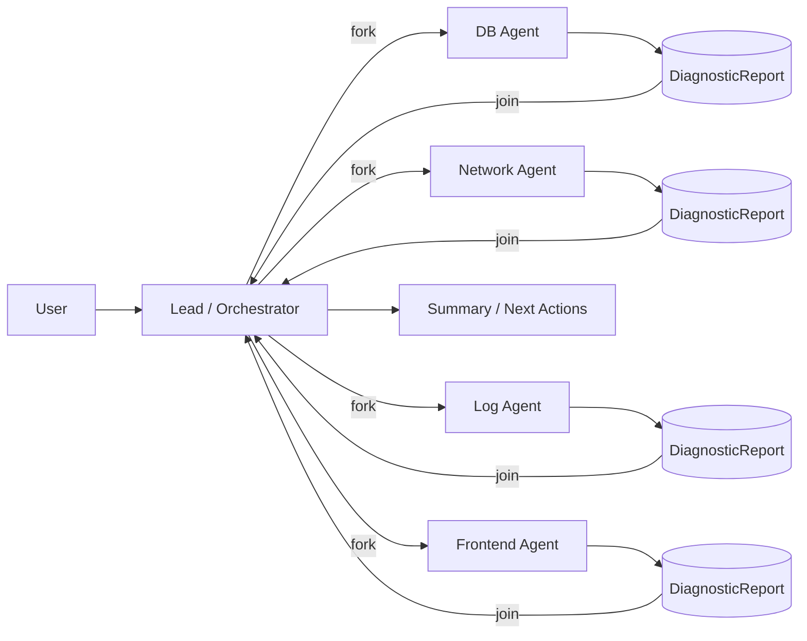
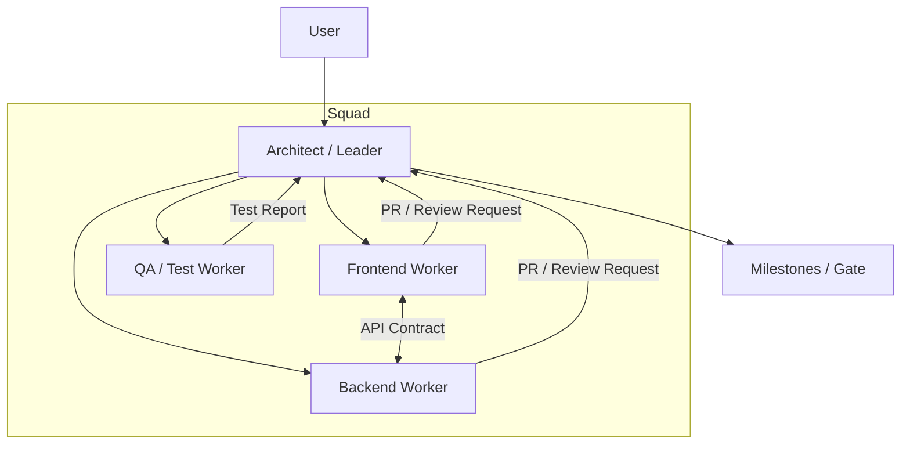

# AgentMesh

AgentMesh 是一个供应商无关（vendor-agnostic）的多 Code Agent 编排框架，用于协调多个异构 agent（如 Codex、Claude、Gemini、Qwen 等）高效完成复杂开发任务。

> 当前状态：WIP（以设计与协议沉淀为主）

## 目标

- 把「一个 agent 扛全栈」升级为「多 agent 专业化分工 + 有序协作」
- 支持并发（fork/join）、里程碑节奏控制、事件驱动任务流转（hooks/triggers）
- 通过“显式共享”降低上下文窗口压力：只在需要时共享必要信息
- 让不同厂商/不同模型/不同工具形态的 agent，可以通过统一适配层协作

## 核心概念（简版）

- **Topologies**：按任务选择协作拓扑（Swarm / Squad）
- **Lifecycle**：Active / Awaiting（沉默待命）/ Dormant（休眠可恢复）
- **Context Scoping**：Global / Task / Private，上下文按需可见
- **Structured Exchange**：用结构化报告/契约替代长对话噪音（例如 `DiagnosticReport`、API Contract）

详细设想见：`Agent Orchestration & Swarm Protocol.md`。

## 模式架构图

### 1) Swarm Mode：并发诊断 / 信息搜集（fork/join）



### 2) Squad Mode：架构师主导的分层小队协作（里程碑推进）



### 3) Context Sharing：显式共享（按需附加 / 作用域隔离）

```mermaid
flowchart LR
  subgraph Global[Global Context]
    G1[Repo Structure]
    G2[Tech Decisions]
  end

  subgraph Task[Task Context]
    T1[Requirements]
    T2[Relevant Files]
    T3[Contracts]
  end

  subgraph Private[Private Context]
    P1[Scratchpad]
    P2[Local Notes]
  end

  A[Agent] -->|read| Global
  A[Agent] -->|read/write| Task
  A[Agent] -->|local only| Private

  A[Agent] -->|explicit attach| X[Shared Attachment\n(UserProfile.tsx / logs / traces)]
  X --> Task
```
