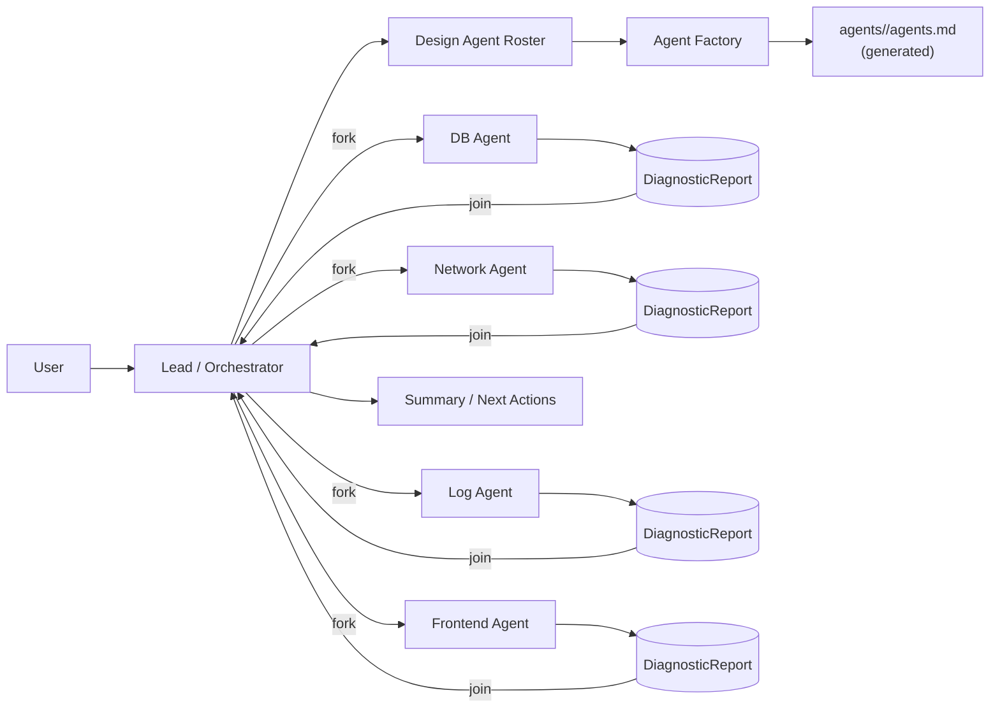
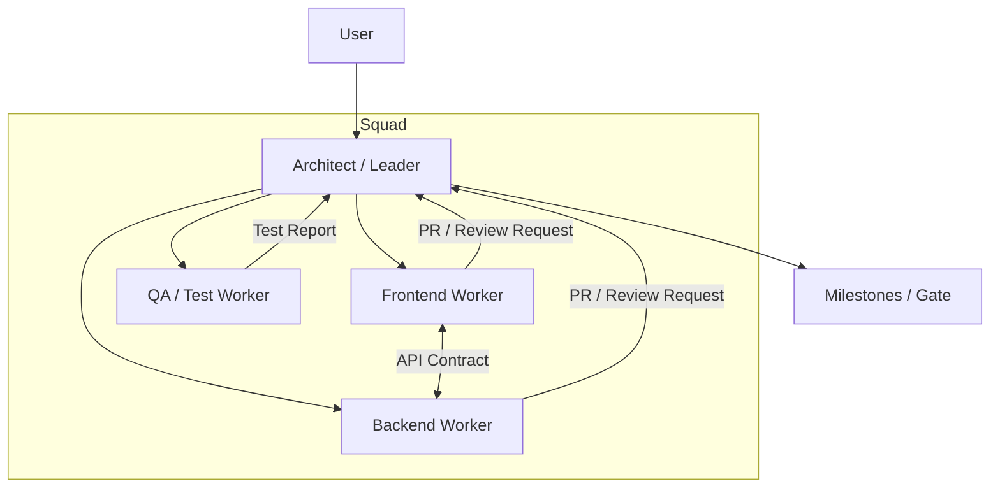

# AgentMesh

AgentMesh 是一个供应商无关（vendor-agnostic）的多 Code Agent 编排框架，用于协调多个异构 agent（如 Codex、Claude、Gemini、Qwen 等）高效完成复杂开发任务。

> 当前状态：WIP（以设计与协议沉淀为主）

## 目标

- 把「一个 agent 扛全栈」升级为「多 agent 专业化分工 + 有序协作」
- 支持并发（fork/join）、里程碑节奏控制、事件驱动任务流转（hooks/triggers）
- 通过“显式共享”降低上下文窗口压力：只在需要时共享必要信息
- 让不同厂商/不同模型/不同工具形态的 agent，可以通过统一适配层协作

## 核心概念（简版）

- **Topologies**：按任务选择协作拓扑（Swarm / Squad）
- **Lifecycle**：Active / Awaiting（沉默待命）/ Dormant（休眠可恢复）
- **Context Scoping**：Global / Task / Private，上下文按需可见
- **Structured Exchange**：用结构化报告/契约替代长对话噪音（例如 `DiagnosticReport`、API Contract）
- **Agent Specs**：由 Lead/Orchestrator 设计 agent 阵容，并为每个 agent 生成可复用的 `agents.md`
- **Skills（机制）**：把可复用的“专家指令”保存在磁盘上，运行时仅注入技能摘要（name/description/path），技能正文按需打开（当前仅为设计约定）
- **Agent Workspace（机制）**：每个 subagent 绑定一个工作空间目录，用 Markdown（带元数据）沉淀可分享内容（当前仅为设计约定）

详细设想见：`Agent Orchestration & Swarm Protocol.md`。

## 目录约定（建议）

- `agents/<agent_name>/agents.md`：该 agent 的角色定义（职责、输入/输出、权限、可见范围等），可由 Lead 生成或使用预置模板
- `agents/<agent_name>/skills/**/SKILL.md`：该 agent 的技能（递归扫描，仅文件名精确为 `SKILL.md` 才生效）
- `workspaces/<agent_instance>/README.md`：subagent 的工作空间入口（沉淀/索引/可共享信息）
- `workspaces/<agent_instance>/**/*.md`：该 subagent 在任务执行/代码探索中产出的可共享内容（都需要元数据）

## Skills（概念 / 定义 / 使用方法）

AgentMesh 计划原封不动引入一套 **Skills（实验性）** 机制（参考 `docs/references/openai-codex/skills.md` 的语义）：

- **Skills 是什么**：磁盘上的“小型可复用能力包”。每个 skill 都有 `name`、`description`（会被注入运行时上下文）以及可选的 Markdown 正文（保留在磁盘上，按需打开）。
- **技能放在哪里**：每个 agent 自己的技能放在 `agents/<agent_name>/skills/**/SKILL.md`（递归）。
  - 只识别文件名**精确**为 `SKILL.md` 的文件。
  - 隐藏条目与符号链接会被跳过（约定）。
  - 渲染顺序：按 `name`，再按路径排序，保证稳定。
- **文件格式**：`SKILL.md` = YAML Front Matter + 可选正文。
  - 必需字段：
    - `name`：非空，≤100 字符（会被清理成单行）
    - `description`：非空，≤500 字符（会被清理成单行）
  - 额外字段会被忽略；正文可以是任意 Markdown（默认不注入上下文）。
- **加载与注入（目标行为）**：启动时加载一次；如果存在有效 skills，则在该 subagent 的运行时上下文中，在 `agents.md` 之后追加 `## Skills`（每条一行，包含 `name`、`description` 与技能文件路径）。
- **校验与错误（目标行为）**：无效 skills（YAML 缺失/非法、字段为空或超长）会被忽略，并产出可见的错误提示/日志，便于修复。

### 创建一个 skill（示例）

在对应 agent 下创建目录与 `SKILL.md`：

```md
---
name: log-triage
description: Summarize logs into a timeline and actionable hypotheses; use when debugging incidents.
---

# Log Triage
- Extract key request_ids / trace_ids.
- Build a short incident timeline.
```

## 模式架构图

### 1) Swarm Mode：Lead 设计阵容 + 并发执行（fork/join）



### 2) Squad Mode：架构师主导的分层小队协作（里程碑推进）



## 内部机制：Subagent Workspace + 显式共享

Context Sharing 不是一种“交互模式”，而是 AgentMesh 的内部工作机制：每个 subagent 拥有独立工作空间，系统在需要时把其中的内容“显式附加（explicit attach）”到协作里，避免全量上下文广播。

### Workspace & Context Scoping（工作空间 + 作用域）

```mermaid
flowchart LR
  subgraph Global[Global Context (shared)]
    G1[Repo Structure]
    G2[Tech Decisions]
  end

  subgraph Task[Task Context (shared)]
    T1[Requirements]
    T2[Relevant Files]
    T3[Contracts]
  end

  subgraph Private[Private Context (agent-local)]
    P1[Scratchpad]
    P2[Local Notes]
  end

  A[Agent] -->|read| Global
  A[Agent] -->|read/write| Task
  A[Agent] -->|local only| Private

  A[Agent] --> W["Workspace Dir<br/>workspaces/&lt;agent_instance&gt;/"]
  W --> W1["README.md<br/>(index)"]
  W --> W2["notes/*.md<br/>(with metadata)"]

  A[Agent] -->|explicit attach| X["Attach Workspace Artifacts<br/>(selected .md files)"]
  X --> Task
```
