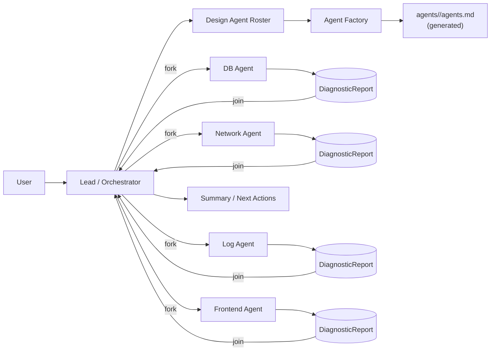
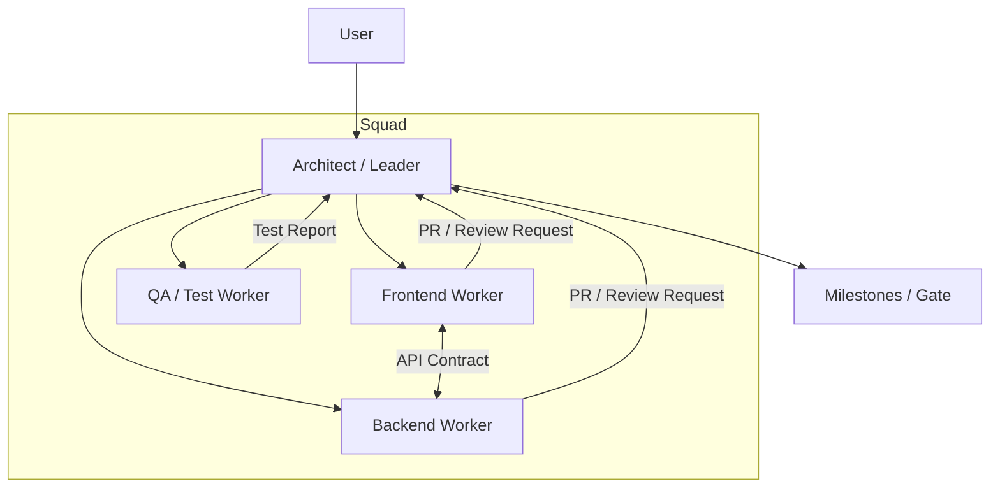
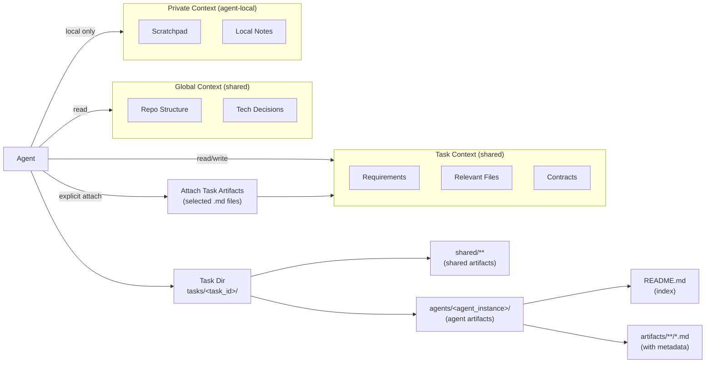

# AgentMesh

AgentMesh 是一个多 `Code Agent` 编排框架，用于协调多个异构 agent（如 `codex`、`Claude Code`、`gemini-cli`、`qwen-code` 等）高效完成复杂开发任务。

> 当前状态：WIP（以设计与产物/运行时落地为主）

## 目标

- 把「一个 agent 扛全栈」升级为「多 agent 专业化分工 + 有序协作」
- 支持并发（`fork`/`join`）、里程碑节奏控制、事件驱动任务流转（`hooks`/`triggers`）
- 通过“显式共享”降低上下文窗口压力：只在需要时共享必要信息
- 让不同厂商/不同模型/不同工具形态的 agent，可以通过统一适配层协作

## 核心概念（简版）

- **Topologies**：按任务选择协作拓扑（`Swarm` / `Squad`）
- **Lifecycle**：Active / Awaiting（沉默待命）/ Dormant（休眠可恢复）
- **Context Scoping**：`Global` / `Task` / `Private`，上下文按需可见
- **Structured Exchange**：用结构化报告/契约替代长对话噪音（例如 `DiagnosticReport`、API Contract）
- **Agent Specs**：由 `Lead/Orchestrator` 设计 agent 阵容，并为每个 agent 生成可复用的 `agents.md`
- **Skills（机制）**：把可复用的“专家指令/脚本/资源”以 Skills 形式保存在磁盘上；每个 agent 可预装不同 skill sets 来增强特定领域能力（如何加载由各运行时/适配器决定）
- **Task（概念）**：一次完整的 `User` - `Agents` 任务交互单元（从需求提出到交付/总结），对应一个可持久化的任务目录；任务内可按 `agent_instance` 归档产出，并通过“显式共享”把必要信息附加给其他 agent（当前仅为设计约定）

详细设想见：[[AgentMesh.md]](./AgentMesh.md)

实现评估与多阶段路线图见：[`docs/agentmesh/README.md`](./docs/agentmesh/README.md)

## 目录约定（建议）

- `.agentmesh/agents/<agent_name>/agents.md`：该 agent 的角色定义（职责、输入/输出、权限、可见范围等），可由 Lead 生成或使用预置模板
- `.agentmesh/agents/<agent_name>/skills/<skill_name>/SKILL.md`：该 agent 的 skill（一个 skill 是包含 `SKILL.md` 的自包含文件夹，可附带脚本/资源）
- `.agentmesh/tasks/<task_id>/README.md`：该任务的入口（目标、状态、里程碑、关键链接）
- `.agentmesh/tasks/<task_id>/shared/**`：任务级共享资产（例如契约、决策、汇总报告等）
- `.agentmesh/tasks/<task_id>/agents/<agent_instance>/README.md`：subagent 在本任务内的产出索引（沉淀/摘要/链接）
- `.agentmesh/tasks/<task_id>/agents/<agent_instance>/**/*.md`：该 subagent 在任务执行/代码探索中产出的可共享内容（都需要元数据）

## Skills（概念 / 定义 / 使用方法）

Skills 的定义遵循 [[skills/README.md]](docs/references/skills/README.md)。不同产品（例如 codex）如何支持/加载 skills 属于其运行时实现细节（可参考 [[openai-codex/skills.md]](docs/references/openai-codex/skills.md)），不作为本项目对 Skills 的扩展。

- **Skill 是什么**：一个自包含文件夹，包含 `SKILL.md`（YAML frontmatter + 指令正文），可附带脚本与资源文件。
- **`SKILL.md` 的关键字段**：`name` 与 `description`（其余字段与更严格的校验规则由各运行时自行决定）。
- **怎么用**：给不同 agent 预装不同的 skill sets；由对应运行时/adapter 决定如何启用（插件/目录约定/启动参数/prompt 指引等）。

### 创建一个 skill（示例）

在对应 agent 下创建目录与 `SKILL.md`：

```md
---
name: log-triage
description: Summarize logs into a timeline and actionable hypotheses; use when debugging incidents.
---

# Log Triage

- Extract key request_ids / trace_ids.
- Build a short incident timeline.
```

## 模式架构图

### 1) Swarm Mode：Lead 设计阵容 + 并发执行（fork/join）



### 2) Squad Mode：架构师主导的分层小队协作（里程碑推进）



## 内部机制：Task Directory + 显式共享

Context Sharing 不是一种“交互模式”，而是 AgentMesh 的内部工作机制：每个任务对应一个可持久化的 `Task Directory`；任务内每个 subagent 把产出沉淀在自己的子目录里，系统在需要时把其中的内容“显式附加（explicit attach）”到协作里，避免全量上下文广播。

### Task Directory & Context Scoping（任务目录 + 作用域）


