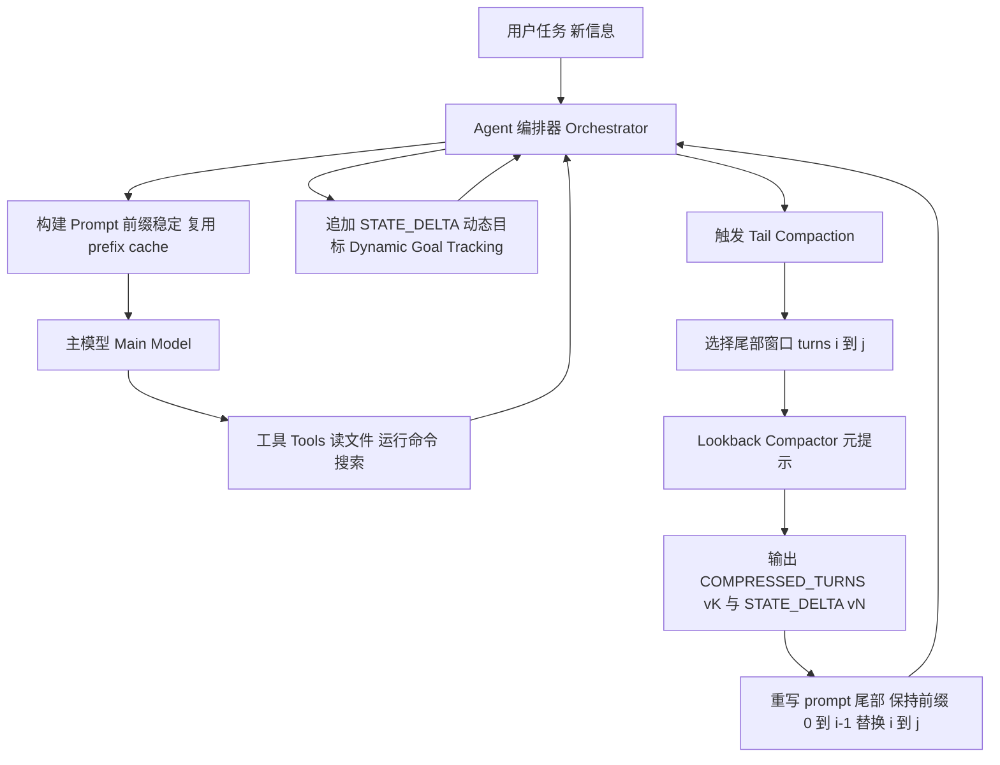

# Workbench State-Flow：面向 Coding Agent 的 Dynamic Goal Tracking + Semantic GC（回望）机制

> 这份文档是一次关于 coding agent「高效上下文机制」的完整回顾与定稿：包含最初设想、讨论与中间方案、工程化取舍，以及可落地的提示词（Prompt）/数据结构与流程图（Mermaid）。

---

## 0. 背景：为什么要做“回望/蒸馏”

在长程编码任务中（调试/重构（debug/refactor）/跨文件修改/跑测试-修复循环），对话上下文（context）会被以下内容迅速填满：

- 大量中间推理步骤（探索、试错、纠错）
- 文件读取的原文（`cat`/`sed -n`/IDE 阅读）
- 终端输出（`grep`/`pytest`/`npm test` 等）

当上下文被噪声占据时，会带来典型退化：

- **SNR（信噪比）下降**：模型注意力被稀释，“看不见关键事实”
- **中间遗忘（Lost-in-the-middle）**：关键信息被夹在中间，模型更易遗漏
- **重复劳动**：反复读同一段代码、反复跑相同命令
- **目标漂移**：做着做着忘了当前真正的任务目标/约束

因此我们希望引入一种“语义层面的垃圾回收（Semantic GC）/回望（Lookback）”机制：在不破坏任务连续性的前提下，把上下文从“卷轴（Scroll）”变成“工作台（Workbench）”。

---

## 1. 最初设想（原始想法）

### 1.1 初始目标

从纯粹语义层面出发（不考虑逐 token（token-by-token）推理的理论最优形态，不考虑训练数据分布偏好的 step-by-step 影响），假设：

- 当前模型能力 + agent 框架机制，已经足以稳定执行编码任务的微操
- 在“回望机制”的加持下，模型可理解 + 可操作的上下文可以被“再扩一扩”
- 代价是阶段性触发额外调用（通过 context 组织来提高 cache hit，成本可控）

### 1.2 原始机制描述（压缩替换）

对连续的一段推理/命令/读文件轮次（turn）做区域性总结：

- 保留关键分析
- 提取高度关联代码块（要求带 `文件路径（file path）+ 起止行号`）
- 终端输出只保留有用区块（block）（命令 + 输出，过长则摘要为断言）
- 移除相关性不高的上下文、思考、冗余输出

并把被压缩区域的多个原生轮次（turn），替换为“总结后的结果块”，以提高后续上下文的任务相关比例。

---

## 2. 讨论与中间结论：从“总结（Summary）”到“Workbench”

### 2.1 关键概念：Semantic GC（移除/保留/摘要）

回望的本质是一种语义 GC：

1. 移除（Remove）：丢弃已完成使命的“过程性噪声”（长推理轨迹（trace）、无效试错、冗长日志）
2. 保留（Retain）：保留 agent 后续行动强依赖的“锚点”（代码片段、路径、行号、报错关键段）
3. 摘要（Summarize）：把大量输出压成可执行断言（例如：`pytest` -> “剩余 1 个失败用例，错误在 X”）

核心指标是：**让上下文里“真正有用的 token 比例”上升**，并且让后续步骤能“接着干活”，而不是“重新探索”。

### 2.2 中间方案：Workbench State-Flow（工作台状态流）

在讨论中，一个更贴近真实工程实践的抽象被提出：把上下文管理成“工作台模型”。

工作台模型包含三个组件：

1) Hot Context（热区/短期工作流）
- 包含近期的推理（reasoning）、工具使用（tool use）、原始输出（raw output）
- 生命周期短：达到阶段结果或到阈值就应被整理

2) State Board（状态看板/全局状态）
- 一个结构化的提示词块（Prompt Block），放在上下文“显眼位置”
- 记录：当前目标、已确认事实、待办、关键代码剪贴板（anchors）、命令断言、当前测试状态等
- 动态更新：目标可能会在探索中发生细化/转向

3) Lookback（回望者/整理进程）
- 读取 Hot Context + 旧 State Board
- 产出：新的 State Board（或增量）、关键 anchors、执行摘要、下一步
- 把“混乱的过程”蒸馏成“可继续执行的状态”

中间关键观点是：**比起只总结“发生了什么”，更重要的是维护“现在是什么状态/下一步是什么”。**

---

## 3. 现实取舍：局部改写 + 前缀不变，最大化复用 cache

进一步讨论后，形成一个更贴近工程落地的判断：

- 现有模型 + 编码框架已经很强，不必极端地清空/重置整个长上下文（long context）
- 在支持 KV cache / prefix cache 的系统里，只要 **压缩点之前的前缀 token 序列保持不变**，就能复用压缩点之前的缓存，显著降成本/提速
- 因此：不必拘泥于严格只追加（append-only）；可以允许对“最近一段热区 turn”做 **局部压缩替换**（只改尾部窗口），同时保持长程前缀稳定
- 思考过程（Thinking）不必彻底丢弃：可以压缩成“结论 + 关键依据 + 决策”，以保留可解释性与复盘价值

核心结论：

- **阶段性提取最新的若干 turn 做压缩，并用 1 个压缩块替换原始多个 turn** 是可行的
- 因为替换发生在尾部窗口，只要“压缩窗口之前的前缀”不动，就可以 **复用压缩窗口之前的 cache**
  - 成本主要来自：压缩块本身 + 压缩点之后的新 token 的重算

---

## 4. 终版工程方案（定稿）

我们讨论下来最终的工程实现方案（保持线性对话流，同时引入动态状态与回望）：

1) 仍然保持 Agent 线性的“对话流”模型（不改变基础交互范式）
2) 增加 Dynamic Goal Tracking（动态目标追踪）
   - 在 AI 自迭代（self-play）阶段，阶段性判断是否需要更新/澄清当前目标、状态、下一步任务
   - 等价于人类在执行任务时持续在更新认知，但是实际人类的更新是选择性全局的(短程认知，微等效于工程上理解所有上下文语义后全局性筛选有效token？)，此处实现上让 agent 自己维护任务规格与进展
3) 增加 Semantic GC（阶段性回望/蒸馏）
   - 显式保留有效内容（anchors、结论、命令断言）
   - 在必要时压缩上下文，提升任务信噪比（Task-SNR），缓解窗口/成本问题

### 4.1 关键落地策略：Tail Compaction（压缩替换最近 N turns）+ 复用 prefix cache

在终版方案里，我们不再区分 Soft/Hard 两档，而是统一采用一种更直接的工程手段：

- **只对“最近的一段热区 turn”做压缩**
- **用 1 个压缩块替换掉原来的多个 turn**
- **随后追加/更新 Dynamic Goal（StateBoard）**
- **保证压缩窗口之前的前缀不变**，以复用该前缀的 KV/prefix cache

一个可实现的运行步骤如下（抽象层面）：

1) 正常线性对话推进：模型推理 -> 工具调用（tool call） -> 输出 -> 推理 -> ...
2) 触发压缩条件后，选定一个“尾部窗口” `[Turn i ... Turn j]`（例如最近 12~30 个 turn，或基于 token 预算自适应）
3) 运行一次回望压缩器（Lookback/Compactor）（同一个或更便宜的模型均可）：
   - 输入：旧 StateBoard + `[i..j]` 的原始内容（含必要的工具输出片段）
   - 输出：
     - `COMPRESSED_TURNS`：可继续执行的压缩结果块（含 anchors / exec assertions / 关键依据）
     - `STATE_DELTA`：对目标/计划/状态的增量更新（Dynamic Goal Tracking）
4) 构造新的上下文：
   - 保留 `[Turn 0 ... Turn i-1]` 原样（用于 cache 命中）
   - 将 `[Turn i ... Turn j]` 替换为 `COMPRESSED_TURNS`
   - 在其后追加最新 `STATE_DELTA`（或合并进 StateBoard）
5) 继续后续回合（新的热区从压缩点之后重新增长）

直觉上，这相当于：**桌面只整理“最近的一堆纸”，前面已经归档的资料不动**；因此既能提高 SNR，又能最大化复用已有 cache。

---

## 5. 运行时数据结构（建议）

为了可实现与可控，建议把工作台信息拆成两个“可机读块”，并对它们做版本化管理：

- `STATE_DELTA vN`：高频、短小（几十到几百 tokens），记录“目标/状态/计划”的增量更新（Dynamic Goal Tracking）
- `COMPRESSED_TURNS vK`：中频、用于 **替换一段尾部窗口 turn** 的压缩块（更完整但受控），记录“这段发生了什么 + 关键依据/锚点 + 当前可继续执行的结论”

### 5.1 StateBoard（建议字段）

建议把状态拆成以下字段（可 JSON）：

- `current_goal`：当前目标（允许细化/转向，但要记录原因）
- `goal_shift_reason`：可选，目标发生显著偏移时说明依据
- `confirmed_facts[]`：已确认事实（必须有证据引用）
- `open_questions[]`：仍未知/待验证问题
- `anchors[]`：关键代码锚点（路径 + 行号 + 最小片段）
- `exec_assertions[]`：命令断言（命令 + 结果摘要）
- `status`：例如测试/构建（tests/build）状态、剩余错误数量
- `next_actions[]`：1-3 个可执行的下一步

### 5.2 防摘要漂移（Summary Drift）：证据约束（强烈建议）

只要系统开始做总结/蒸馏，就会面对“总结逐步偏离事实（summary drift）”的问题。

为降低漂移，建议加一条硬规则：

- `confirmed_facts` 必须包含 `evidence` 指针（至少一个）
  - 例：`file:src/a.py:L40-L55` / `cmd#12 exit=1` / `test#3 failed:...`
- `anchors` 必须来自已读内容（工具输出/已缓存片段），不允许“凭空重建代码”

这会让 GC 更像“语义 GC + 引用计数”，而不是自由摘要。

---

## 6. 触发策略（启发式，易工程化）

### 6.1 Dynamic Goal Tracking（高频、小步）

触发时机（任一满足）：

- 完成一个子问题闭环：定位根因/确认修复策略/完成一个补丁（patch）
- 工具输出带来关键新事实：新的报错堆栈、找到关键函数、确认依赖关系

输出：`STATE_DELTA vN`（短、结构化）

### 6.2 Tail Compaction（中频、压缩替换尾部窗口）

触发时机（任一满足）：

- 连续 N 次工具调用（tool call）（例如 8-15 次）
- 最近若干轮次（turn）的原始输出（raw output）/读文件原文占比过高（经验上：你已经开始“看不清楚关键信息”了）
- 发现重复读文件/重复跑命令的迹象（通常意味着上下文 SNR 已经下降）
- 出现明确的“逻辑断点”：根因已确认、修复策略已确定、一次测试回合已结束等

窗口选择（关键约束）：

- 只选尾部窗口 `[Turn i ... Turn j]` 来压缩替换
- 尽量保证 `[Turn 0 ... Turn i-1]` 完全不变，用于复用 prefix cache
- 可选：保留最新 1-2 个轮次（turn）不压缩（让 agent 继续在“最新热区”工作）

输出（建议同时产出两个块）：

- `COMPRESSED_TURNS vK`：用于 **替换** `[i..j]` 的压缩块（含 anchors / 执行断言（exec assertions）/关键依据/思考摘要（thinking summary））
- `STATE_DELTA vN`：对当前目标、阶段状态、下一步的增量更新（Dynamic Goal Tracking）

执行效果：

- 用 `COMPRESSED_TURNS vK` 替换掉原始 `[i..j]` 多个轮次（turn），并在其后追加最新 `STATE_DELTA vN`
- 前缀不变 => 压缩点之前的缓存可复用；成本主要是压缩块与压缩点之后的新 token

---

## 7. Prompt 模板（可直接用于工程实现）

### 7.1 Dynamic Goal Tracking：追加 `STATE_DELTA`

```text
[Meta 指令 / STATE_UPDATE]
你正在更新 Workbench 的 StateBoard。不要改写历史对话。
基于最新观察（工具输出、代码片段、决策），追加一个 STATE_DELTA，包含：

- current_goal: 简洁，允许细化之前目标（保持原始意图）
- confirmed_facts: 只写带 evidence 的事实
- open_questions: 仍未知/待确认的问题
- next_actions: 1-3 个具体可执行步骤
- anchors: 已看到的代码片段或引用（path + line range）
- exec_assertions: 重要命令及结果的断言式摘要

规则：
- 如果目标发生明显变化，记录 goal_shift_reason
- 不要臆造代码；anchors 必须从已观察内容中复制
- 控制在 250 tokens 以内
返回 JSON。
```

### 7.2 Tail Compaction：生成替换块 `COMPRESSED_TURNS` + 追加 `STATE_DELTA`

```text
[Meta 指令 / TAIL_COMPACTION]
你是 Lookback/Compactor。你的任务是压缩一段尾部窗口 turns。
Orchestrator 会用你输出的 `COMPRESSED_TURNS` 替换原始 turns `[Turn i ... Turn j]`，
然后在其后追加你输出的 `STATE_DELTA`。

你能看到的输入：
- 旧的 StateBoard（如有）
- turns `[i..j]` 的原始内容（模型消息 + 工具输出）

输出要求（返回 JSON，包含两个顶层字段）：

1) compressed_turns（COMPRESSED_TURNS vK）
  - replaces: {start_turn: i, end_turn: j}
  - goal: 当前目标（可细化；保持原始意图）
  - what_we_learned: 高层总结；把关键推理写成 “结论 + evidence”，不要输出原始 chain-of-thought
  - anchors: 只保留高度相关且已经出现过的代码片段
      * 每项: {path, start_line, end_line, snippet}
  - exec_assertions: 重要命令与结果的短断言
  - open_questions: 阻塞推进的未知点
  - next_actions: 1-3 个具体下一步

2) state_delta（STATE_DELTA vN）
  - 与你在其他地方使用的 StateBoard delta schema 一致

规则：
- 禁止幻觉；不确定就标注 unknown
- anchors/snippet 必须从已观察内容中复制（不要重建代码）
- 用断言替代长输出
- 控制整个 JSON 在严格 token 预算内（例如 <= 800 tokens）
```

---

## 8. 示例：一次“共享上下文 + 尾部压缩替换”的运行样貌（示意）

> 目的：展示只压缩替换“最近窗口”，保持前缀稳定（复用 cache），也能显著提高任务信噪比（Task-SNR）。

1) Agent 在热区完成探索：读文件、跑测试、定位根因（大量原始输出（raw output））
2) 触发 `STATE_DELTA v12`（短）：
   - 记录：根因位置、已确认事实、下一步补丁（patch）
3) 再继续执行若干步后触发一次 Tail Compaction（压缩替换尾部窗口）：
   - 选取最近 12-30 个轮次（turn）（或基于 token 预算自适应）作为 `[Turn i..j]`
   - 产出 `COMPRESSED_TURNS v3` + `STATE_DELTA v13`
4) Orchestrator 重写上下文尾部：
   - `[Turn 0..i-1]` 完全不变（cache 命中）
   - `[Turn i..j]` 替换为 `COMPRESSED_TURNS v3`
   - 在其后追加 `STATE_DELTA v13`
5) 模型在后续步骤被强约束：
   - 优先使用最新 `STATE_DELTA` 与 `COMPRESSED_TURNS` 里的 anchors/断言
   - 需要原始细节时再回工具/外部日志查证，而不是在长对话里“翻旧账”

---

## 9. Mermaid：终版流程图（工程抽象）



---

## 10. 取舍与风险清单（以及缓解策略）

### 10.1 主要取舍

- Cache 复用 vs Token 真压缩（通过“尾部压缩替换”折中）
  - 只要压缩发生在尾部窗口，就能复用压缩点之前的 prefix cache
  - 被替换的窗口及其之后的 token 需要重算，但总体 token 会“物理减少”
  - 压缩窗口选得越大：token 收益越大，但潜在信息损失风险也越高；需要靠 anchors/evidence 兜底

- 可解释性 vs 极致短上下文
  - 不强删 thinking，而是将其浓缩为“结论 + 依据”
  - 便于复盘与调试 agent 行为

- 更新频率 vs 噪声
  - `STATE_DELTA` 过频会反而变成噪声
  - 通过 token 预算（例如 <=250 tokens）与触发启发式控制

### 10.2 主要风险与缓解

- Summary drift（总结漂移）
  - 缓解：confirmed facts 必须带 evidence；anchors 必须可溯源；不确定要显式标注 unknown

- 状态冲突（新旧状态不一致）
  - 缓解：版本号 + “latest wins” 规则；必要时在 `STATE_DELTA/COMPRESSED_TURNS` 中显式合并冲突并标注

- 被替换 turn 的细节丢失（影响回放/审计/深挖）
  - 缓解：将原始 turns/tool output 归档到外部日志/存储（不进 prompt，但可按需检索）
  - 缓解：压缩块输出 `replaces:{start_turn,end_turn}`，保证可追溯

- 过度结构化导致模型“写文档”而非“干活”
  - 缓解：state/cp 都要短；把“下一步动作”限制为 1-3 个可执行步骤；不要引入过重 schema

---

## 11. 附加探讨：按 turn 范围分组压缩（Span/Range-Based Compaction）

你提的这个“在实际一个 turn 完成之后，把推理/终端执行/读文件等连续 turns 成组，并按语义指定范围做压缩替换”的做法，本质上是把 Tail Compaction 从“按 token 预算/启发式选窗口”进一步工程化成“按业务语义的 span 来选窗口”。

结论：**完全可行**，并且在满足一个关键约束时，可以复用压缩点之前的 cache。

### 11.1 什么时候可行（cache 视角）

- 如果你压缩替换的是“当前对话尾部最近的一段 turns”（也就是 rewrite 发生在尾部），那么：
  - `[Turn 0..i-1]` 作为前缀不变 => 可复用这部分 prefix cache
  - 重算成本主要来自：`COMPRESSED_TURNS` + 其后的新增 token
- 如果你尝试压缩替换的是“对话中间的一段 turns”，而其后还有大量后续内容：
  - 由于压缩会改变后续 token 序列，压缩点之后的 cache 基本都要失效重算
  - 这并非不可做，但收益/成本需要评估（通常只在极端长会话或必须清理噪声时做）

### 11.2 工程实现：不用“手动构造一堆 turn”，让 Orchestrator 维护双轨日志

你担心的“需要手动构造一堆 turn/trace 回原始会话流/手动加 message/重新 cache”可以完全自动化。

建议把运行时日志分成两条轨：

1) `raw_trace`（全量可审计）
- 保留原始 messages/tool output/终端输出（可压缩存储，但可检索）
- 用于回放、debug agent、必要时追证据

2) `prompt_view`（面向模型的工作上下文）
- 这是每次发给模型的 messages 列表
- 允许在尾部把 `[i..j]` 替换为 `COMPRESSED_TURNS`
- 始终保证 `[0..i-1]` 不变以复用 cache

这相当于：原始对话永远在（审计用），给模型看的“工作台视图”可以被整理。

### 11.3 如何“语义指定 turn 范围”：推荐显式 span 标记，而不是纯语义猜测

“语义指定范围”有两种落地方式：

**A. 纯语义选择（不推荐作为唯一手段）**
- 例如让模型判断“从开始定位 root cause 到确认修复策略”为一个窗口
- 风险：边界不稳定、复现性差，且容易在噪声大时选错范围

**B. 显式 span（推荐）**
- Orchestrator 在开始一个子任务/工具链时打标：
  - `SPAN_START(id=diagnose#3, goal=...)`
  - 工具调用/输出都自然落在 span 内
  - 在收敛点打标：`SPAN_END(id=diagnose#3, outcome=...)`
- Tail Compaction 时直接压缩替换该 span 对应的 turns
- 好处：边界确定、可复现、便于评估与回放

### 11.4 运行序列（抽象）

1) 执行子任务，记录 span：
   - `SPAN_START` -> assistant/tool/tool_result/assistant... -> `SPAN_END`
2) 触发 compaction：
   - Orchestrator 取出 span 覆盖的 turns `[i..j]`
   - 用 `TAIL COMPACTION` prompt 生成 `COMPRESSED_TURNS` + `STATE_DELTA`
3) 重写 prompt_view：
   - 保留前缀 `[0..i-1]` 不变（cache）
   - 替换 `[i..j]` 为 `COMPRESSED_TURNS`
   - 追加 `STATE_DELTA`

### 11.5 注意事项（工具调用与可追溯）

- tool calling 的 `tool_call_id` 等协议字段，在该次调用完成后通常不再需要继续喂给模型；但为了审计/回放，应保存在 `raw_trace`
- `COMPRESSED_TURNS` 建议携带：
  - `replaces:{start_turn,end_turn}` 或 `span_id`
  - `anchors`（可直接继续改代码）
  - `exec_assertions`（把长输出压成断言）
  - `evidence` 指针（必要时能回 `raw_trace` 追溯）

---

## 12. 最终一句话总结

这套终版方案的精神是：

- **仍然线性对话流（最稳、最兼容、最可缓存）**
- **用 Dynamic Goal Tracking 把“人脑中的任务规格”变成显式状态**
- **用 Semantic GC（尾部窗口压缩替换）提高 SNR、控制上下文成本，同时复用压缩点之前的 cache**
- **用证据约束与 anchors 防漂移，保证可继续执行与可审计性**

---

## Appendix A. Task Flow Notes（TODO probing / lead confirmation）

以下内容原本记录在 `docs/note.md`，与 Workbench 的“状态看板 + 人工介入（gates）”结合更紧密，因此合并到此处，便于集中查找。

- 为每个 task 内的 agent 分配一个 task-level workflow（例如 todo list）。
- 当 agent 交付子任务但未主动更新 todo 时，可以对它做一次“试探提醒”，要求它更新 todo；若已更新，则提示下一步与状态转移。
- 在任务每个节点询问：是否存在分歧需要 Lead 确认；Lead 能否确认、是否理解用户意图；如有不确定性则提供 options，把决策权交还给用户。
- 这一机制本质上是在 subagent 执行环节引入一条“用户输入”：
  - subagent 提问是否需要 Lead 确认
  - Lead 给出确认/不确认与原因
  - 用户做最终决策
  - 若该段对话不应污染主线程上下文，可配合 fork/rollback 或 detached thread 处理
